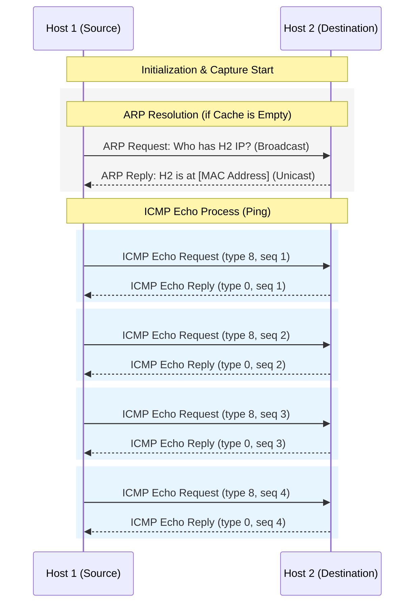

```mermaid
sequenceDiagram
    participant H1 as Host 1 (Source)
    participant H2 as Host 2 (Destination)

    Note over H1, H2: Initialization & Capture Start
    
    rect rgb(245, 245, 245)
    Note over H1, H2: ARP Resolution (if Cache is Empty)
    H1->>H2: ARP Request: Who has H2 IP? (Broadcast)
    H2-->>H1: ARP Reply: H2 is at [MAC Address] (Unicast)
    end

    Note over H1, H2: ICMP Echo Process (Ping)
    
    rect rgb(230, 245, 255)
    H1->>H2: ICMP Echo Request (type 8, seq 1)
    H2-->>H1: ICMP Echo Reply (type 0, seq 1)
    end

    rect rgb(230, 245, 255)
    H1->>H2: ICMP Echo Request (type 8, seq 2)
    H2-->>H1: ICMP Echo Reply (type 0, seq 2)
    end

    rect rgb(230, 245, 255)
    H1->>H2: ICMP Echo Request (type 8, seq 3)
    H2-->>H1: ICMP Echo Reply (type 0, seq 3)
    end

    rect rgb(230, 245, 255)
    H1->>H2: ICMP Echo Request (type 8, seq 4)
    H2-->>H1: ICMP Echo Reply (type 0, seq 4)
    end
```

